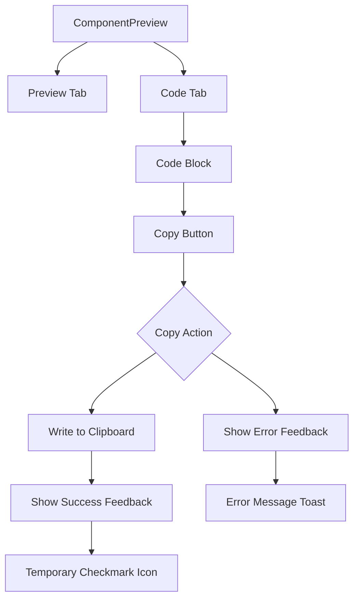
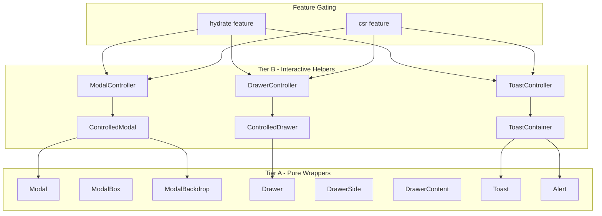

# leptos-daisyui Implementation Plan

## Executive Summary

The leptos-daisyui library has made significant progress toward feature parity with daisyUI. This analysis reveals that **63 out of 65 daisyUI components have been implemented** in the core library, with comprehensive manifest documentation for 65 components. The showcase app has pages for all major components, but **only 11 pages have updated code snippets** that demonstrate proper usage patterns.

### Key Findings

| Category | Components Implemented | Showcase Pages Updated |
|----------|----------------------|------------------------|
| Actions | 4/4 (100%) | 3/4 (75%) |
| Data Display | 19/19 (100%) | 6/19 (32%) |
| Data Input | 12/12 (100%) | 0/12 (0%) |
| Navigation | 9/9 (100%) | 0/9 (0%) |
| Layout | 13/13 (100%) | 1/13 (8%) |
| Mockups | 4/4 (100%) | 0/4 (0%) |
| Feedback | 3/3 (100%) | 0/3 (0%) |
| Overlay | 2/2 (100%) | 1/2 (50%) |

---

## Gap Analysis: Component Implementation Status

### Fully Implemented Components

The following components have both library implementations AND showcase pages with proper code snippets:

| Component | Library | Manifest | Showcase | Code Snippets |
|-----------|---------|----------|----------|---------------|
| Button | ✅ | ✅ | ✅ | ✅ |
| Dropdown | ✅ | ✅ | ✅ | ✅ |
| Modal | ✅ | ✅ | ✅ | ✅ |
| Alert | ✅ | ✅ | ✅ | ✅ |
| Avatar | ✅ | ✅ | ✅ | ✅ |
| Badge | ✅ | ✅ | ✅ | ✅ |
| Card | ✅ | ✅ | ✅ | ✅ |
| Carousel | ✅ | ✅ | ✅ | ✅ |
| Collapse | ✅ | ✅ | ✅ | ✅ |
| Drawer | ✅ | ✅ | ✅ | ✅ |
| Tooltip | ✅ | ✅ | ✅ | ✅ |

### Implemented but Needs Showcase Updates

These components have library implementations but showcase pages need code snippet updates:

#### Actions
| Component | Library | Manifest | Showcase | Issue |
|-----------|---------|----------|----------|-------|
| Swap | ✅ | ✅ | ⏳ | Needs code snippets |

#### Data Display
| Component | Library | Manifest | Showcase | Issue |
|-----------|---------|----------|----------|-------|
| Chat | ✅ | ✅ | ⏳ | Needs code snippets |
| Countdown | ✅ | ✅ | ⏳ | Needs code snippets |
| Diff | ✅ | ✅ | ⏳ | Needs code snippets |
| Kbd | ✅ | ✅ | ⏳ | Needs code snippets |
| List | ✅ | ✅ | ⏳ | Needs code snippets |
| Progress | ✅ | ✅ | ⏳ | Needs code snippets |
| Radial Progress | ✅ | ✅ | ⏳ | Needs code snippets |
| Rating | ✅ | ✅ | ⏳ | Needs code snippets |
| Skeleton | ✅ | ✅ | ⏳ | Needs code snippets |
| Stat | ✅ | ✅ | ⏳ | Needs code snippets |
| Status | ✅ | ✅ | ⏳ | Needs code snippets |
| Table | ✅ | ✅ | ⏳ | Needs code snippets |
| Timeline | ✅ | ✅ | ⏳ | Needs code snippets |

#### Data Input
| Component | Library | Manifest | Showcase | Issue |
|-----------|---------|----------|----------|-------|
| Checkbox | ✅ | ✅ | ⏳ | Needs code snippets |
| Fieldset | ✅ | ✅ | ⏳ | Needs code snippets |
| File Input | ✅ | ✅ | ⏳ | Needs code snippets |
| Filter | ✅ | ✅ | ⏳ | Needs code snippets |
| Input | ✅ | ✅ | ⏳ | Needs code snippets |
| Label | ✅ | ✅ | ⏳ | Needs code snippets |
| Radio | ✅ | ✅ | ⏳ | Needs code snippets |
| Range | ✅ | ✅ | ⏳ | Needs code snippets |
| Select | ✅ | ✅ | ⏳ | Needs code snippets |
| Textarea | ✅ | ✅ | ⏳ | Needs code snippets |
| Toggle | ✅ | ✅ | ⏳ | Needs code snippets |
| Validator | ✅ | ✅ | ⏳ | Needs code snippets |

#### Navigation
| Component | Library | Manifest | Showcase | Issue |
|-----------|---------|----------|----------|-------|
| Bottom Navigation | ✅ | ❌ | ⏳ | Needs manifest + code snippets |
| Breadcrumbs | ✅ | ✅ | ⏳ | Needs code snippets |
| Dock | ✅ | ✅ | ⏳ | Needs code snippets |
| Link | ✅ | ✅ | ⏳ | Needs code snippets |
| Menu | ✅ | ✅ | ⏳ | Needs code snippets |
| Navbar | ✅ | ✅ | ⏳ | Needs code snippets |
| Pagination | ✅ | ✅ | ⏳ | Needs code snippets |
| Steps | ✅ | ✅ | ⏳ | Needs code snippets |
| Tab | ✅ | ✅ | ⏳ | Needs code snippets |

#### Layout
| Component | Library | Manifest | Showcase | Issue |
|-----------|---------|----------|----------|-------|
| Artboard | ✅ | ✅ | ⏳ | Needs code snippets |
| Divider | ✅ | ✅ | ⏳ | Needs code snippets |
| Footer | ✅ | ✅ | ⏳ | Needs code snippets |
| Hero | ✅ | ✅ | ⏳ | Needs code snippets |
| Indicator | ✅ | ✅ | ⏳ | Needs code snippets |
| Join | ✅ | ✅ | ⏳ | Needs code snippets |
| Mask | ✅ | ✅ | ⏳ | Needs code snippets |
| Stack | ✅ | ✅ | ⏳ | Needs code snippets |
| Layout (DaisyUI) | ✅ | ✅ | ⏳ | Needs code snippets |
| Stacked Layout | ✅ | ✅ | ⏳ | Needs code snippets |
| Sidebar Layout | ✅ | ✅ | ⏳ | Needs code snippets |
| Multi-Column | ✅ | ✅ | ⏳ | Needs code snippets |

#### Mockups
| Component | Library | Manifest | Showcase | Issue |
|-----------|---------|----------|----------|-------|
| Mockup Browser | ✅ | ✅ | ⏳ | Needs code snippets |
| Mockup Code | ✅ | ✅ | ⏳ | Needs code snippets |
| Mockup Phone | ✅ | ✅ | ⏳ | Needs code snippets |
| Mockup Window | ✅ | ✅ | ⏳ | Needs code snippets |

#### Feedback
| Component | Library | Manifest | Showcase | Issue |
|-----------|---------|----------|----------|-------|
| Loading | ✅ | ✅ | ⏳ | Needs code snippets |
| Toast | ✅ | ✅ | ⏳ | Needs code snippets |

#### Overlay
| Component | Library | Manifest | Showcase | Issue |
|-----------|---------|----------|----------|-------|
| Backdrop | ✅ | ✅ | ⏳ | Needs code snippets |

---

## Missing Components Analysis

Based on comparison with daisyUI's official component list, the following may need investigation:

### Potentially Missing from Library

| Component | daisyUI Status | Library Status | Notes |
|-----------|---------------|----------------|-------|
| Theme Controller | Built-in | ⚠️ Partial | Handled via theme selector in showcase, may need dedicated component |

### Additional Layout Components

The library includes extended layout components not in core daisyUI:
- `StackedLayout` / `StackedShell` - Application layout pattern
- `SidebarLayout` - Application layout pattern
- `MultiColumnShell` - Application layout pattern
- `Container`, `Grid`, `Panel`, `Sidebar` - Layout primitives

These are value-add components that follow daisyUI conventions.

---

## Missing Variants for Existing Components

Based on manifest analysis, some components may be missing typed props for certain modifiers:

### Button Component
- ✅ All color variants implemented
- ✅ All size variants implemented
- ✅ All style variants implemented (outline, ghost, link, soft, dash)
- ✅ Shape modifiers (square, circle) implemented
- ✅ State modifiers (active, loading, disabled) implemented
- ⚠️ `btn-wide` and `btn-block` implemented as boolean props (correct approach)

### Alert Component
- ✅ All color variants implemented
- ✅ Style variants (outline, dash, soft) implemented
- ✅ Layout direction (vertical/horizontal) implemented
- ✅ Sub-components (AlertIcon, AlertTitle, AlertContent, AlertActions) implemented

### Card Component
- ✅ Layout modifiers (bordered, compact, normal, side) implemented
- ⚠️ Size modifiers (card-sm, card-md, card-lg) - verify implementation
- ✅ Sub-components (CardHeader, CardBody, CardTitle, CardActions) implemented

### Modal Component
- ✅ Position variants implemented
- ✅ ModalBackdrop, ModalBox, ModalAction sub-components
- ⚠️ Responsive dialog behavior may need Tier B helper

### Components Needing Variant Review

| Component | Missing Variants | Priority |
|-----------|-----------------|----------|
| Modal | `modal-bottom`, `modal-middle` responsive | Medium |
| Drawer | `drawer-end` placement | Low |
| Dropdown | `dropdown-top`, `dropdown-left`, `dropdown-right` positions | Medium |
| Menu | Submenu collapse/expand state | Medium |
| Toast | Position variants (all corners) | Low |

---

## Showcase App Enhancement Plan

### Current State

The showcase app uses a [`ComponentPreview`](crates/showcase/src/components/component_preview.rs:5) component that displays:
1. A title and description
2. A tabbed interface with "Preview" and "Code" tabs
3. The rendered component in the Preview tab
4. A code snippet in the Code tab (using `mockup-code`)

### Missing Features

1. **Code Snippet Copy Button** - No copy functionality exists
2. **Syntax Highlighting** - Code displayed as plain text
3. **Interactive Examples** - Some components lack reactive demos
4. **Responsive Preview** - No viewport size toggling

### Code Snippet Copy Feature Design



#### Implementation Requirements

1. **Copy Button Component**
   - Position: Top-right of code block
   - Icon: Clipboard/copy icon (SVG)
   - States: Default, Copying, Success, Error
   - Feedback: Visual state change + optional toast

2. **Clipboard Integration**
   - Use `web_sys::navigator::clipboard()` for CSR/hydrate
   - Graceful fallback for SSR
   - Handle permissions gracefully

3. **UI/UX Pattern**
   - Similar to daisyUI's component pages
   - Button appears on hover (desktop) or always visible (mobile)
   - Success state shows checkmark for 2 seconds
   - Non-blocking - does not interrupt user flow

#### Proposed Component Structure

```rust
// New component for code display with copy functionality
#[component]
pub fn CodeBlock(
    #[prop(into)] code: String,
    #[prop(optional, into)] language: Option<String>,
    #[prop(optional)] show_line_numbers: bool,
) -> impl IntoView {
    // Copy button with clipboard integration
    // Syntax highlighting (optional, could use tree-sitter or highlight.js)
    // Line numbers toggle
}
```

### Enhanced ComponentPreview

```rust
#[component]
pub fn ComponentPreview(
    #[prop(optional, into)] title: Option<String>,
    #[prop(optional, into)] description: Option<String>,
    #[prop(into)] code: String,
    #[prop(optional)] responsive: bool,  // NEW: Enable viewport toggle
    #[prop(optional, into)] height: Option<String>,  // NEW: Custom preview height
    children: Children,
) -> impl IntoView
```

---

## Prioritized Implementation Roadmap

### Phase 1: Showcase Foundation (High Priority)

**Goal:** Complete code snippet infrastructure for all component pages.

#### 1.1 Code Snippet Copy Feature
- Create `CopyButton` component with clipboard integration
- Add to `ComponentPreview` code tab
- Implement success/error feedback
- Test across SSR/CSR/Hydrate modes

#### 1.2 Update Remaining Showcase Pages (52 pages)
Follow the established pattern from completed pages:

**Priority Order:**
1. **High-Usage Components** (Data Input)
   - Input, Select, Checkbox, Toggle, Textarea
   - These are used in almost every application

2. **Navigation Components**
   - Menu, Navbar, Tab, Breadcrumbs
   - Essential for application structure

3. **Data Display Components**
   - Table, List, Stat, Timeline
   - Common in dashboard/data-heavy apps

4. **Layout Components**
   - Stack, Join, Indicator, Hero
   - Building blocks for complex layouts

5. **Remaining Components**
   - Mockups, Feedback, Overlay

### Phase 2: Component Variant Completion (Medium Priority)

**Goal:** Ensure all daisyUI modifiers have typed props where appropriate.

#### 2.1 Audit Existing Components
- Review each manifest against implementation
- Identify missing typed props
- Document escape-hatch usage patterns

#### 2.2 Add Missing Variants
- Position variants for Dropdown, Modal, Drawer
- Size variants for Card and other components
- State variants where applicable

#### 2.3 Tier B Interactive Helpers
- Modal: Controlled open/close state helper
- Drawer: Controlled toggle helper
- Toast: Toast queue/manager component
- Dropdown: Keyboard navigation enhancement

### Phase 3: Enhanced Showcase Features (Lower Priority)

**Goal:** Match daisyUI's component page experience.

#### 3.1 Syntax Highlighting
- Integrate highlight.js or similar
- Support Rust/Leptos syntax
- Theme-aware code colors

#### 3.2 Responsive Preview
- Viewport size toggle (mobile/tablet/desktop)
- Breakpoint visualization
- Device frame mockups

#### 3.3 Interactive Playground
- Live code editing
- Real-time preview
- Export to CodeSandbox/StackBlitz

### Phase 4: Documentation & Polish

#### 4.1 API Documentation
- Document all component props
- Add usage examples to rustdoc
- Generate API reference

#### 4.2 Accessibility Audit
- Verify ARIA attributes
- Test keyboard navigation
- Screen reader compatibility

#### 4.3 Performance Optimization
- Review component bundle sizes
- Optimize re-renders
- Lazy loading for showcase

---

## Component Complexity Classification

### Simple Components (Minimal Effort)
These components have few variants and straightforward markup:
- Badge, Kbd, Label, Status, Divider, Mask, Skeleton, Loading

### Medium Components (Moderate Effort)
These have multiple variants or sub-components:
- Alert, Avatar, Button, Card, Checkbox, Input, Radio, Select, Toggle
- Collapse, Dropdown, Menu, Navbar, Tab, Tooltip

### Complex Components (Significant Effort)
These have interactive behavior or many variants:
- Modal, Drawer, Carousel, Chat, Countdown, Diff, Rating
- Table, Timeline, Toast, Validator, Pagination, Steps
- All Layout components

---

## Technical Implementation Notes

### Code Snippet Copy Implementation

```rust
// Example implementation for clipboard copy
#[cfg(any(feature = "csr", feature = "hydrate"))]
async fn copy_to_clipboard(text: &str) -> Result<(), JsValue> {
    let navigator = window().navigator();
    let clipboard = navigator.clipboard().ok_or_else(|| {
        JsValue::from_str("Clipboard API not available")
    })?;
    clipboard.write_text(text).await
}

#[cfg(not(any(feature = "csr", feature = "hydrate")))]
fn copy_to_clipboard(_text: &str) -> Result<(), &'static str> {
    Err("Clipboard not available during SSR")
}
```

### Showcase Page Template

Each updated page should follow this structure:

```rust
#[component]
pub fn ComponentNamePage() -> impl IntoView {
    view! {
        <div class="space-y-10">
            // Header with title and description
            <header class="space-y-3">
                <h1 class="text-3xl font-bold">"Component Name"</h1>
                <p class="text-base-content/70 max-w-3xl">
                    "Description of the component and its use cases."
                </p>
            </header>

            // Sections for each variant/pattern
            <section class="space-y-4">
                <ComponentPreview
                    title="Variant Name"
                    code=r#"<ComponentName variant={Variant::Example}>"Content"</ComponentName>"#
                >
                    // Actual component usage
                    <ComponentName variant={Variant::Example}>"Content"</ComponentName>
                </ComponentPreview>
            </section>

            // Additional sections...
        </div>
    }
}
```

---

## Success Metrics

### Phase 1 Completion Criteria
- [ ] All 65 component pages have updated code snippets
- [ ] Copy button functional on all code blocks
- [ ] `cargo leptos build` passes with no errors/warnings
- [ ] All code snippets are copy-pasteable usage examples

### Phase 2 Completion Criteria
- [ ] All daisyUI modifiers have typed props or documented escape-hatch
- [ ] Manifest files updated to reflect actual implementation
- [ ] Tier B helpers available for complex interactive components

### Phase 3 Completion Criteria
- [ ] Syntax highlighting implemented
- [ ] Responsive preview available
- [ ] Interactive playground prototype

---

## Appendix: daisyUI Component Categories

### Actions (4 components)
Button, Dropdown, Modal, Swap

### Data Display (19 components)
Alert, Avatar, Badge, Card, Carousel, Chat, Collapse, Countdown, Diff, Kbd, List, Progress, Radial Progress, Rating, Skeleton, Stat, Status, Table, Timeline

### Data Input (12 components)
Checkbox, Fieldset, File Input, Filter, Input, Label, Radio, Range, Rating, Select, Textarea, Toggle, Validator

### Navigation (9 components)
Bottom Navigation, Breadcrumbs, Dock, Link, Menu, Navbar, Pagination, Steps, Tab

### Layout (13 components)
Artboard, Divider, Drawer, Footer, Hero, Indicator, Join, Mask, Stack, plus extended layout components

### Mockups (4 components)
Browser, Code, Phone, Window

### Feedback (3 components)
Loading, Skeleton, Toast

### Overlay (2 components)
Backdrop, Tooltip

---

---

## Phase 2 Analysis: Missing Typed Variant Props

### Audit Summary

This section documents the analysis of existing component implementations against daisyUI v5 documentation to identify missing typed variant props.

### Components with Complete Typed Props

The following components have full typed variant support matching daisyUI documentation:

| Component | Color | Size | Variant | State | Other | Status |
|-----------|-------|------|---------|-------|-------|--------|
| Button | ✅ Color | ✅ Size | ✅ Variant | ✅ State | ✅ square, circle, glass, wide, block | Complete |
| Alert | ✅ AlertVariant | ✅ AlertStyle | ✅ AlertDirection | - | - | Complete |
| Badge | ✅ Color | ✅ Size | ✅ Variant | - | ✅ outline | Complete |
| Card | - | ✅ Size | ✅ CardVariant | - | ✅ bordered, compact, side | Complete |
| Input | ✅ Color | ✅ Size | ✅ Variant | - | ✅ disabled, readonly, required | Complete |
| Select | ✅ Color | ✅ Size | ✅ Variant | - | ✅ disabled | Complete |
| Modal | ✅ ModalColor | - | ✅ ModalPosition | ✅ ModalState | ✅ open | Complete |
| Dropdown | - | - | ✅ DropdownPosition | ✅ DropdownState | ✅ DropdownHover | Complete |
| Toast | - | - | ✅ ToastHorizontal/Vertical | - | - | Complete |
| Loading | ✅ Color | ✅ Size | ✅ LoadingVariant | - | - | Complete |
| Status | ✅ Color | ✅ Size | - | - | ✅ animate | Complete |
| Rating | - | ✅ Size | ✅ RatingMask | - | ✅ RatingHalf | Complete |
| Textarea | ✅ Color | ✅ Size | ✅ Variant | - | ✅ disabled, readonly, required | Complete |
| Range | ✅ Color | ✅ Size | - | - | ✅ min, max, step | Complete |
| Swap | - | - | ✅ SwapAnimation | ✅ active | - | Complete |
| Collapse | - | - | ✅ CollapseTrigger/Icon | ✅ CollapseState | - | Complete |
| Carousel | - | - | ✅ CarouselSnap/Orientation | - | - | Complete |

### Components with Missing Typed Props

| Component | Missing Prop | daisyUI Classes | Priority | Notes |
|-----------|-------------|-----------------|----------|-------|
| Checkbox | `variant` | `checkbox-primary`, `checkbox-outline`, `checkbox-ghost` | Medium | Has Color, Size but missing style variants |
| Radio | `variant` | `radio-primary`, `radio-outline` | Medium | Has Color, Size but missing style variants |
| Toggle | `variant` | `toggle-primary`, `toggle-outline` | Medium | Has Color, Size but missing style variants |
| Drawer | `position` | `drawer-end` | Low | Currently uses `end: bool`, should use enum |
| Menu | `color` | `menu-primary`, `menu-secondary`, etc. | Low | Has Size but missing color variants |
| Tab | `color` | Individual tabs can have color | Low | Has TabVariant, Size but missing color |
| Table | `color` | Table does not have color in daisyUI | N/A | False positive - Table is complete |
| Progress | `size` | `progress-xs`, `progress-sm`, `progress-md`, `progress-lg`, `progress-xl` | Medium | Missing size variants |
| Skeleton | `size` | No size variants in daisyUI | N/A | False positive - Skeleton is complete |
| FileInput | `variant` | `file-input-bordered`, `file-input-ghost` | Medium | Has `bordered: bool`, `ghost: bool` - should use enum |
| Steps | `size` | `steps-xs`, `steps-sm`, `steps-md`, `steps-lg`, `steps-xl` | Low | Missing size prop |
| Pagination | `color` | Buttons can have color via class | Low | Has Size but missing color for buttons |

### Recommended Additions

#### High Priority

1. **Progress Size** - Add `Size` prop to Progress component
   ```rust
   #[prop(optional, into)] size: Option<Size>,
   ```

2. **FileInput Variant** - Replace boolean props with enum
   ```rust
   #[derive(Clone, Copy, Debug, Default, PartialEq, Eq)]
   pub enum FileInputVariant {
       #[default]
       Default,
       Bordered,
       Ghost,
   }
   ```

#### Medium Priority

3. **Checkbox/Radio/Toggle Variant** - Add style variant support
   ```rust
   #[prop(optional, into)] variant: Option<Variant>,
   ```

4. **Drawer Position Enum** - Replace `end: bool` with typed enum
   ```rust
   #[derive(Clone, Copy, Debug, Default, PartialEq, Eq)]
   pub enum DrawerPosition {
       #[default]
       Start,  // Left side (default)
       End,    // Right side
   }
   ```

#### Low Priority

5. **Menu Color** - Add color prop for menu styling
6. **Steps Size** - Add size prop for steps component

---

## Phase 2: Tier B Interactive Helpers Design

### Overview

Tier B helpers provide imperative control and reactive state management for interactive components. These are feature-gated under `#[cfg(feature = "hydrate")]` or `#[cfg(any(feature = "csr", feature = "hydrate"))]` to ensure SSR safety.

### 1. ModalController

#### Purpose
Provide imperative control for modal dialogs with:
- Programmatic open/close via signals
- Backdrop click handling
- Escape key handling
- Responsive positioning

#### API Design

```rust
// In src/interactive/modal_controller.rs

/// Reactive controller for modal state
#[cfg(feature = "hydrate")]
pub struct ModalController {
    /// Signal controlling modal visibility
    pub is_open: RwSignal<bool>,
    /// Optional callback when modal opens
    pub on_open: Option<Callback<()>>,
    /// Optional callback when modal closes
    pub on_close: Option<Callback<()>>,
}

#[cfg(feature = "hydrate")]
impl ModalController {
    /// Create a new modal controller
    pub fn new() -> Self {
        Self {
            is_open: RwSignal::new(false),
            on_open: None,
            on_close: None,
        }
    }

    /// Open the modal
    pub fn open(&self) {
        self.is_open.set(true);
        if let Some(cb) = self.on_open {
            cb.run(());
        }
    }

    /// Close the modal
    pub fn close(&self) {
        self.is_open.set(false);
        if let Some(cb) = self.on_close {
            cb.run(());
        }
    }

    /// Toggle modal state
    pub fn toggle(&self) {
        if self.is_open.get() {
            self.close();
        } else {
            self.open();
        }
    }
}

/// Hook for modal controller with automatic cleanup
#[cfg(feature = "hydrate")]
pub fn use_modal() -> ModalController {
    ModalController::new()
}
```

#### ControlledModal Component

```rust
/// Modal component controlled by ModalController
#[cfg(feature = "hydrate")]
#[component]
pub fn ControlledModal(
    controller: ModalController,
    #[prop(optional)] position: ModalPosition,
    #[prop(optional)] color: ModalColor,
    #[prop(optional, into)] class: MaybeProp<String>,
    #[prop(optional)] close_on_backdrop: bool,
    #[prop(optional)] close_on_escape: bool,
    children: Children,
) -> impl IntoView {
    // Handle escape key
    let handle_keydown = move |ev: KeyboardEvent| {
        if close_on_escape && ev.key() == "Escape" {
            controller.close();
        }
    };

    // Handle backdrop click
    let handle_backdrop_click = move |_| {
        if close_on_backdrop {
            controller.close();
        }
    };

    view! {
        <dialog
            class=class
            open=move || controller.is_open.get()
            on:keydown=handle_keydown
        >
            {children()}
            {close_on_backdrop.then(|| view! {
                <form method="dialog" class="modal-backdrop" on:click=handle_backdrop_click>
                    <button>"close"</button>
                </form>
            })}
        </dialog>
    }
}
```

#### Usage Example

```rust
#[component]
fn ExamplePage() -> impl IntoView {
    let modal = use_modal();

    view! {
        <Button on:click=move |_| modal.open()>"Open Modal"</Button>
        
        <ControlledModal
            controller=modal
            position={ModalPosition::Middle}
            close_on_backdrop=true
            close_on_escape=true
        >
            <ModalBox>
                <h3 class="text-lg font-bold">"Hello!"</h3>
                <p>"This is a controlled modal."</p>
                <ModalAction>
                    <Button on:click=move |_| modal.close()>"Close"</Button>
                </ModalAction>
            </ModalBox>
        </ControlledModal>
    }
}
```

---

### 2. DrawerController

#### Purpose
Provide imperative control for drawer/sidebar with:
- Programmatic open/close via signals
- Position control (left/right)
- Overlay handling
- Responsive behavior (always-open on large screens)

#### API Design

```rust
// In src/interactive/drawer_controller.rs

/// Reactive controller for drawer state
#[cfg(feature = "hydrate")]
pub struct DrawerController {
    /// Signal controlling drawer visibility
    pub is_open: RwSignal<bool>,
    /// Drawer position
    pub position: RwSignal<DrawerPosition>,
}

#[cfg(feature = "hydrate")]
impl DrawerController {
    /// Create a new drawer controller
    pub fn new() -> Self {
        Self {
            is_open: RwSignal::new(false),
            position: RwSignal::new(DrawerPosition::Start),
        }
    }

    /// Create with specific position
    pub fn with_position(position: DrawerPosition) -> Self {
        Self {
            is_open: RwSignal::new(false),
            position: RwSignal::new(position),
        }
    }

    /// Open the drawer
    pub fn open(&self) {
        self.is_open.set(true);
    }

    /// Close the drawer
    pub fn close(&self) {
        self.is_open.set(false);
    }

    /// Toggle drawer state
    pub fn toggle(&self) {
        self.is_open.update(|v| *v = !*v);
    }
}

/// Drawer position enum
#[derive(Clone, Copy, Debug, Default, PartialEq, Eq)]
pub enum DrawerPosition {
    #[default]
    Start,  // Left side (default)
    End,    // Right side
}
```

#### ControlledDrawer Component

```rust
/// Drawer component controlled by DrawerController
#[cfg(feature = "hydrate")]
#[component]
pub fn ControlledDrawer(
    controller: DrawerController,
    #[prop(optional, into)] id: MaybeProp<String>,
    #[prop(optional, into)] class: MaybeProp<String>,
    #[prop(optional)] always_open_on: Option<Breakpoint>,  // e.g., "lg"
    children: Children,
) -> impl IntoView {
    let drawer_class = move || {
        let mut classes = vec!["drawer"];
        if controller.position.get() == DrawerPosition::End {
            classes.push("drawer-end");
        }
        if let Some(bp) = always_open_on {
            // Add responsive class like "lg:drawer-open"
            classes.push(&format!("{}:drawer-open", bp.as_str()));
        }
        if let Some(c) = class.get() {
            classes.push(&c);
        }
        classes.join(" ")
    };

    view! {
        <div class=drawer_class>
            <input
                type="checkbox"
                class="drawer-toggle"
                checked=move || controller.is_open.get()
                on:change=move |ev| {
                    controller.is_open.set(event_target_checked(&ev));
                }
            />
            {children()}
        </div>
    }
}
```

---

### 3. ToastController

#### Purpose
Provide toast notification management with:
- Queue-based toast display
- Auto-dismiss with configurable timeout
- Position control
- Multiple toast stacking

#### API Design

```rust
// In src/interactive/toast_controller.rs

/// Unique identifier for a toast
#[derive(Clone, Debug, PartialEq, Eq, Hash)]
pub struct ToastId(uuid::Uuid);

/// Toast configuration
#[derive(Clone, Debug)]
pub struct ToastConfig {
    pub id: ToastId,
    pub message: String,
    pub variant: AlertVariant,
    pub duration: Option<Duration>,  // None = no auto-dismiss
    pub position: ToastPosition,
    pub created_at: Instant,
}

/// Toast position configuration
#[derive(Clone, Copy, Debug, Default, PartialEq, Eq)]
pub struct ToastPosition {
    pub horizontal: ToastHorizontal,
    pub vertical: ToastVertical,
}

/// Reactive controller for toast notifications
#[cfg(feature = "hydrate")]
pub struct ToastController {
    /// Queue of active toasts
    toasts: RwSignal<Vec<ToastConfig>>,
    /// Default position for new toasts
    default_position: RwSignal<ToastPosition>,
    /// Default duration for auto-dismiss
    default_duration: Option<Duration>,
}

#[cfg(feature = "hydrate")]
impl ToastController {
    /// Create a new toast controller
    pub fn new() -> Self {
        Self {
            toasts: RwSignal::new(Vec::new()),
            default_position: RwSignal::new(ToastPosition::default()),
            default_duration: Some(Duration::from_secs(5)),
        }
    }

    /// Show a toast notification
    pub fn show(&self, message: impl Into<String>, variant: AlertVariant) -> ToastId {
        let config = ToastConfig {
            id: ToastId(uuid::Uuid::new_v4()),
            message: message.into(),
            variant,
            duration: self.default_duration,
            position: self.default_position.get(),
            created_at: Instant::now(),
        };
        let id = config.id.clone();
        self.toasts.update(|t| t.push(config));
        
        // Auto-dismiss if duration is set
        if let Some(duration) = self.default_duration {
            let toasts = self.toasts;
            let id_clone = id.clone();
            set_timeout(
                move || {
                    toasts.update(|t| t.retain(|toast| toast.id != id_clone));
                },
                duration,
            );
        }
        
        id
    }

    /// Show a success toast
    pub fn success(&self, message: impl Into<String>) -> ToastId {
        self.show(message, AlertVariant::Success)
    }

    /// Show an error toast
    pub fn error(&self, message: impl Into<String>) -> ToastId {
        self.show(message, AlertVariant::Error)
    }

    /// Show a warning toast
    pub fn warning(&self, message: impl Into<String>) -> ToastId {
        self.show(message, AlertVariant::Warning)
    }

    /// Show an info toast
    pub fn info(&self, message: impl Into<String>) -> ToastId {
        self.show(message, AlertVariant::Info)
    }

    /// Dismiss a specific toast
    pub fn dismiss(&self, id: &ToastId) {
        self.toasts.update(|t| t.retain(|toast| &toast.id != id));
    }

    /// Dismiss all toasts
    pub fn dismiss_all(&self) {
        self.toasts.set(Vec::new());
    }

    /// Get all active toasts
    pub fn get_toasts(&self) -> Vec<ToastConfig> {
        self.toasts.get()
    }
}

/// Hook for toast controller (singleton pattern)
#[cfg(feature = "hydrate")]
pub fn use_toast() -> ToastController {
    // Use a global signal for toast state
    static TOASTS: RwSignal<Vec<ToastConfig>> = RwSignal::new(Vec::new);
    ToastController {
        toasts: TOASTS,
        default_position: RwSignal::new(ToastPosition::default()),
        default_duration: Some(Duration::from_secs(5)),
    }
}
```

#### ToastContainer Component

```rust
/// Container component that renders all active toasts
#[cfg(feature = "hydrate")]
#[component]
pub fn ToastContainer(
    controller: ToastController,
    #[prop(optional)] position: ToastPosition,
    #[prop(optional, into)] class: MaybeProp<String>,
) -> impl IntoView {
    let toasts = move || {
        controller.toasts.get()
            .into_iter()
            .filter(|t| t.position == position)
            .collect::<Vec<_>>()
    };

    view! {
        <div class={format!("toast {} {}", position.horizontal.cls(), position.vertical.cls())}>
            <For
                each=toasts
                key=|toast| toast.id.clone()
                children=move |toast| {
                    let controller_clone = controller.clone();
                    let id = toast.id.clone();
                    view! {
                        <Alert variant={toast.variant}>
                            {toast.message}
                            <Button
                                size={Size::Small}
                                variant={Variant::Ghost}
                                on:click=move |_| controller_clone.dismiss(&id)
                            >
                                "✕"
                            </Button>
                        </Alert>
                    }
                }
            />
        </div>
    }
}
```

#### Usage Example

```rust
#[component]
fn ExamplePage() -> impl IntoView {
    let toast = use_toast();

    view! {
        <Button on:click=move |_| toast.success("Operation successful!"))>
            "Show Success"
        </Button>
        <Button on:click=move |_| toast.error("Something went wrong!"))>
            "Show Error"
        </Button>
        
        <ToastContainer controller={toast} position={ToastPosition::default()} />
    }
}
```

---

### Tier B Implementation Architecture



---

### Implementation Priority Order

#### Phase 2.1: Missing Typed Props (Estimated: 8 components)

| Priority | Component | Task | Effort |
|----------|-----------|------|--------|
| 1 | Progress | Add Size prop | Small |
| 2 | FileInput | Add FileInputVariant enum | Small |
| 3 | Checkbox | Add Variant prop | Small |
| 4 | Radio | Add Variant prop | Small |
| 5 | Toggle | Add Variant prop | Small |
| 6 | Drawer | Add DrawerPosition enum | Small |
| 7 | Steps | Add Size prop | Small |
| 8 | Menu | Add Color prop | Small |

#### Phase 2.2: Tier B Interactive Helpers

| Priority | Helper | Description | Effort |
|----------|--------|-------------|--------|
| 1 | ModalController | Imperative modal control with backdrop/escape handling | Medium |
| 2 | ToastController | Toast queue with auto-dismiss | Medium |
| 3 | DrawerController | Imperative drawer control with responsive support | Medium |

---

## Next Steps

1. **Immediate:** Implement code snippet copy functionality
2. **Short-term:** Update remaining 52 showcase pages with code snippets
3. **Phase 2.1:** Add missing typed variant props to components
4. **Phase 2.2:** Implement Tier B interactive helpers
5. **Long-term:** Enhanced showcase features and documentation

This plan provides a clear path to feature parity with daisyUI while maintaining the quality standards established by the project.
